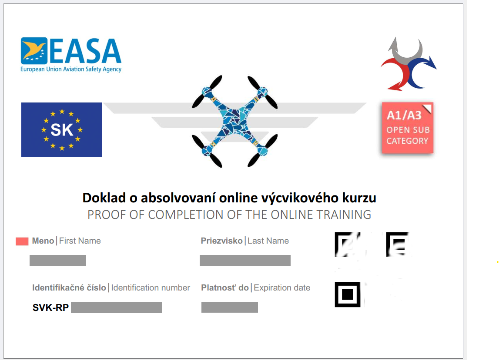

Toto má byť ako neoficiálna pomôcka pre "bežných modelárov" ku online skúške "Pilot na diaľku A1/A3" na Dopravnom úrade SR, ktorej cieľom má byť získanie dokladu o absolvovaní výcvikového kurzu.  

  

 
Text na tejto stránke je veľmy stručný a je potrebné ho chápať v kontexte danej legislatívy. Ani zďaleka nepopisuje celú problematiku prevádzkovania UAS.  

Text obsahuje citácie z verejne dostupných stránok  [Dopravného úradu SR](http://letectvo.nsat.sk/bezpilotne-letectvo/).  

### Letecké modelárstvo  
Rovnako ako drony, **modely lietadiel sú bezpilotné lietadlá**, na ktoré sa vzťahuje Nariadenie (EÚ) 2019/947. Oba majú lietajúcu časť a diaľkové ovládanie.  

V kontexte "leteckého modelárstva" a citovaného Nariadenie ide o tieto UAS zariadenia:  
- lietajúce modely s označením triedy **C4**,  
- **súkromne vyrobené modely** lietadiel s max. vzletovou hmotnosťou **menej ako 25 kg**.
  
Lety s modelmi triedy **C4** a so **súkromne vyrobenými modelmi do 25 kg** sa môžu vykonávať s lietajúcimi modelmi v **podkategórii A3**. Prevádzka musí byť v súlade s podmienkami stanovenými v časti A UAS.OPEN.040 prílohy k nariadeniu (EÚ) 2019/947.  

Lety diaľkovo riadených lietajúcich modelov je možné v **otvorenej kategórii** po splnení príslušných podmienok, vrátane:  
- registrácie prevádzkovateľa UAS,  
- absolvovania skúšky pre pilotov A1/A3.

[Registrácia prevádzkovateľa UAS](http://letectvo.nsat.sk/bezpilotne-letectvo/registracia-prevadzkovatelov-uas/) - teda aj leteckých modelov, ako aj [online kurz a skúšku](http://letectvo.nsat.sk/bezpilotne-letectvo/skusky-pilotov-na-dialku/) "Pilot na diaľku A1/A3", sú bezplatné.  

### Základ legislatívy

*"Na vykonanie letu bezpilotným lietadlom je pilot na diaľku povinný byť držiteľom dokladu o spôsobilosti v súlade s požiadavkami nariadenia (EÚ) 2019/947 podľa kategórie prevádzky."*  

Ak prevádzkujete bezpilotné lietadlo s hmotnosťou nad 250 g, tak **na prevádzku v podkategórii A1 a A3 je pilot povinný absolvovať online skúšku teoretických vedomostí A1/A3**. Na prevádzku v podkategórii A2 je pilot povinný absolvovať online výcvikový kurz A1/A3 spolu s dodatočnou skúškou teoretických vedomostí A2. V podkategórii A2 možno prevádzkovať len také bezpilotné lietadlo, ktoré je označené identifikačným štítkom triedy C2. Na prevádzku v osobitnej kategórii podľa štandardných scenárov (STS01, STS02) je potrebné absolvovať skúšku teoretických vedomostí STS.  

[Oficiálne informácie Dopravného úradu.](http://letectvo.nsat.sk/bezpilotne-letectvo/)  

## Hlavné témy kurzu  
 
Dopravný úrad SR zostavil 9 hlavných tém kurzu. Obsah tvorí základ vedomostí potrebných pre úspešnú skúšku pilota A1/A3, ale v dokumentoch sú aj odkazy na ďalší štúdijný materiál.  

[1. Letecká bezpečnosť](1_Letecka_bezpecnost.html)  
[2. Obmedzenia vzdušného priesitoru](2_Obmedzenia_vzd_priestoru.html)  
[3. Letecké predpisy](3_Letecke_predpisy.html)  
[4. Obmedzenia ľudskej výkonnosti](4_Obmedzenia_ludskej_vykonnosti.html)  
[5. Prevádzkové postupy](5_Prevadzkove_postupy.html)  
[6. Všeobecné znalosti o UAS](6_Vseobecne_znalosti_o_UAS.html)  
[7. Ochrana súkromia a osobných údajov](7_Ochrana_sukromia_a_osobnych_udajov.html)  
[8. Poistenie](8_Poistenie.html)  
[9. Bezpečnosť](9_Bezpečnost.html)  

## Ďalšie užitočné linky:
- [drony Legislatíva 2024](https://www.xtreme.sk/clanok/14/drony-legislativa-2024/)
- [Letecké modelárstvo](http://letectvo.nsat.sk/bezpilotne-letectvo/letecke-modelarstvo/)
- [poistenie dronov](https://www.dronerepublic.sk/poistenie-dronov/)  
- [mamdron.sk](https://mamdron.sk/piloti-dronov/)  

